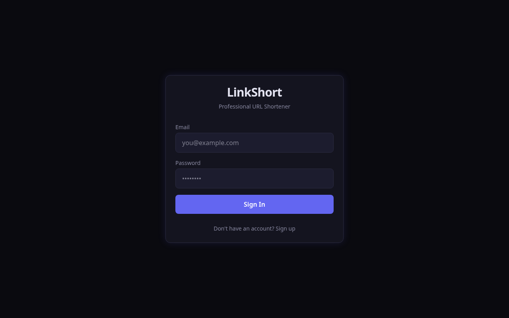
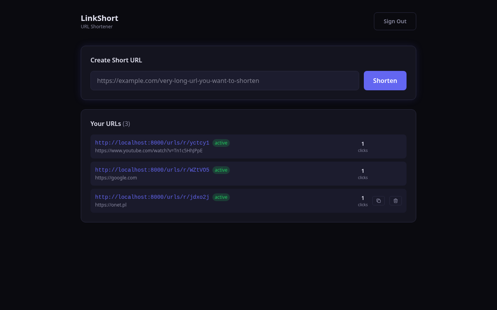
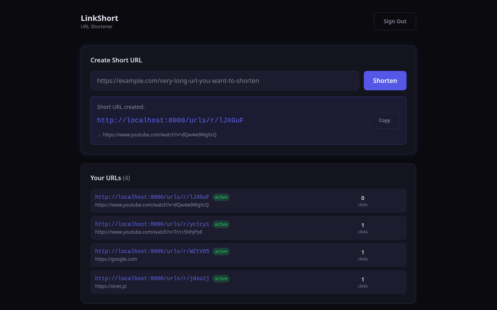

# LinkShort — URL Shortener


**URL shortener with JWT auth, click tracking, and dark UI. Full REST API + React SPA.**

| | | |
|---|---|---|
|  |  |  |

## Features

- JWT authentication — register, login, token-based API access
- One-click shortening — paste URL, get short code
- Click tracking — each redirect increments counter
- Dashboard — manage URLs: copy, delete, stats
- Copy to clipboard — one-click copy
- Dark UI — professional dark theme, responsive
- REST API — Swagger docs at `/docs`
- SQLite — zero-config persistence

## Tech Stack

| Layer | Tech |
|---|---|
| Backend | Python 3.12, FastAPI, SQLAlchemy, SQLite |
| Auth | JWT (python-jose), SHA-256 |
| Frontend | React 19, Vite, TailwindCSS 4 |
| Testing | pytest, httpx |

## Quick Start

```bash
git clone https://github.com/voicenotesite/FastAPI-url.git
cd FastAPI-url
python3 -m venv venv
source venv/bin/activate
pip install -r requirements.txt
uvicorn app.main:app --host 0.0.0.0 --port 8000 --reload
```

Open [http://localhost:8000](http://localhost:8000)

### Build Frontend

```bash
cd frontend
npm install
npm run build
rm -rf ../backend/static
mkdir -p ../backend/static
cp -r dist/* ../backend/static/
```

## API

| Method | Endpoint | Auth | Description |
|--------|----------|------|-------------|
| `POST` | `/auth/register` | — | Create account |
| `POST` | `/auth/login` | — | Login, returns JWT |
| `GET` | `/auth/me` | Bearer | Current user |
| `POST` | `/urls/shorten` | Bearer | Create short URL |
| `GET` | `/urls/my` | Bearer | List your URLs |
| `GET` | `/urls/r/{code}` | — | Redirect to target |
| `DELETE` | `/urls/{code}` | Bearer | Delete URL |

## Deploy

```bash
# Cloudflare Tunnel (free, no account)
cloudflared tunnel --url http://localhost:8000
```

## Testing

```bash
pytest tests/ -v
```

## License

MIT

## 🌐 Ecosystem

This project is part of the [Bartosz Web Portfolio](https://voicenotesite.github.io/WebBartosz/) ecosystem.
